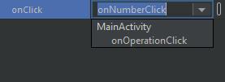

# Программирование обработчика событий

Лабораторная работа № 3

Разработка мобильного приложения «Калькулятор»

**Цель работы**: создать мобильное приложение «Калькулятор».

**Порядок выполнения работы:**

**Запуск среды**

1. Вам необходимо открыть проект, который вы сделали в ходе первой части лабораторной работы №3.

**Разработка обработчика**

1. Кликните на любую кнопку будущего калькулятора и найдите в меню Attributes свойство onClick.

2. В данном свойстве можно прописывать собственные функции, не применяя стандартный обработчик setOnClickListener.

3. Перейдите в файл MainActivity.kt

4. Обработчик для аттрибута onClick будет выглядеть следующим образом:

fun onNumberClick\(number: View\){  
 var numberButton: Button = number as Button  
 result.append\(numberButton._text_\)  
}

Однако, в подобной функции может быть лишь один параметр типа View. В ином случае функцию нельзя будет назначить аттрибуту onClick. В примере ниже для функции onNumberClick кроме параметра типа View был прописан параметр типа Double.

 

**Задание для самостоятельной работы:**

* Написать обработчики для кнопок \(2 балла\)
* Ограничиться двумя обработчиками для кнопок, для сохранения принципа DRY – do not repeat yourself \(не повторяйся\) \(1 балла\)

**Порядок сдачи отчета работы:**

на проверку преподавателю сдаются:

* Apk-файл приложения
* Файл с обработчиками MainActivity.kt
* Файл с макетом activity\_main.xml

