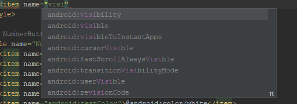

# Разработка дизайна мобильного приложения

Лабораторная работа № 3

Разработка мобильного приложения «Калькулятор»

**Цель работы**: создать мобильное приложение «Калькулятор».

**Порядок выполнения работы:**

**Установка среды**

1. Скачать установочный файл Android Studio вы сможете, перейдя по этому сайту: [https://developer.android.com/studio/](https://developer.android.com/studio/)

* Необходимая версия Android Studio выберется автоматически, однако если что-то пошло не так, то вы можете выбрать Download options и выбрать необходимую версию для вашей ОС самостоятельно.\

**Верстка**

1. После того, как вы сгенерируете шаблон для проекта Calculator, вам необходимо создать дизайн калькулятора. Перейдите в файл activity\_main.xml.

2. Калькулятор будет содержать:

* 2 текстовых поля
* 10 кнопок с цифрами
* 6 кнопок с операциями \(плюс, минус, умножение, деление и удаление\)

3. Кнопкам необходимо присвоить id и текстовое значение \(лучший вариант сделать это через Strings\)

4. Кнопки располагаются таким образом, чтобы было примерно 4 кнопки в ряду. Чтобы расположить их таким образом, необходимо создать необходимо:

1. Выстроить кнопки в ряд
2. Создать Constraints:
   1. для первой кнопки ряда: для левой границы экрана и нижней границы экрана или к верхней границе первой кнопки предыдущего ряда
   2. для последней кнопки только к правой границе экрана
3. При зажатии клавиши CTRL выделить 4 кнопки ряда
4. Кликнуть правой кнопкой мыши по любой кнопке ряда:
   1. Выровнять по верхушке \(Align Top Edges\)
   2. Заполнить пустоты между кнопками \(Organize -&gt; Expand Horizontally\)

5. После того, как вы создадите несколько рядов кнопок вам необходимо будет добавить два текстовых поля:

* первое текстовое поле будет содержать текущее введённое значение
* второе текстовое поле будет содержать текущий результат вычислений

6. Для первого текстового поля:

1. Создайте ограничение к левой и правой границам экрана и к верхней границе любой из кнопок последнего ряда кнопок
2. В аттрибутах \(меню Attributes\) выставите необходимый id и ширину со значение match\_constraint \(layout\_width match\_constraint\)
3. Также в аттрибутах очистите текст

7. Для второго текстового поля:

1. Создайте ограничение к левой и правой и верхней границам экрана и к верхней границе текстового поля
2. В аттрибутах \(меню Attributes\) выставите необходимый id и ширину и высоту со значениями match\_constraint \(layout\_width/layout\_height  match\_constraint\)
3. Также в аттрибутах очистите текст

8. На данном этапе закончена расположение всех элементов на экране, однако остается важный этап стилизации приложения.

Стили находятся в папке res values styles.xml.

&lt;style name="ActionButtonStyle"&gt;  
 &lt;item name="android:layout\_width"&gt;0dp&lt;/item&gt;  
 &lt;item name="android:layout\_height"&gt;match\_parent&lt;/item&gt;  
 &lt;item name="android:layout\_weight"&gt;1&lt;/item&gt;  
 &lt;item name="android:background"&gt;@color/actionButton&lt;/item&gt;  
 &lt;item name="android:textSize"&gt;21sp&lt;/item&gt;  
 &lt;item name="android:textColor"&gt;@android:color/white&lt;/item&gt;  
 &lt;item name="android:gravity"&gt;center&lt;/item&gt;  
 &lt;item name="android:layout\_margin"&gt;0.5dp&lt;/item&gt;  
&lt;/style&gt;

В стиле выше вы должны обязательно задать имя стиля. Каждый предмет стиля обозначается ключевым словом &lt;item&gt;. Имена аттрибутов, которые вы хотите задать вы можете найти в меню Attributes для каждого View-элемента. Когда вы будете задавать имя – среда разработки предложит вам возможные аттрибуты.

**Задание для самостоятельной работы:**

* Создать дизайн калькулятора \(1 балл\)
* Создать стили для калькулятора \(1 балл\):
  * для цифр;
  * для математических операций;
  * сделать текст крупным.

**Порядок сдачи отчета работы:**

на проверку преподавателю сдаются:

* Apk-файл приложения
* Файл с обработчиками MainActivity.kt
* Файл с макетом activity\_main.xml

